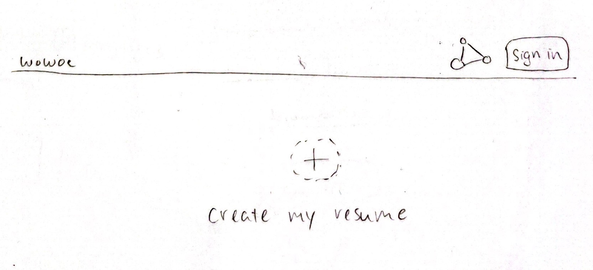
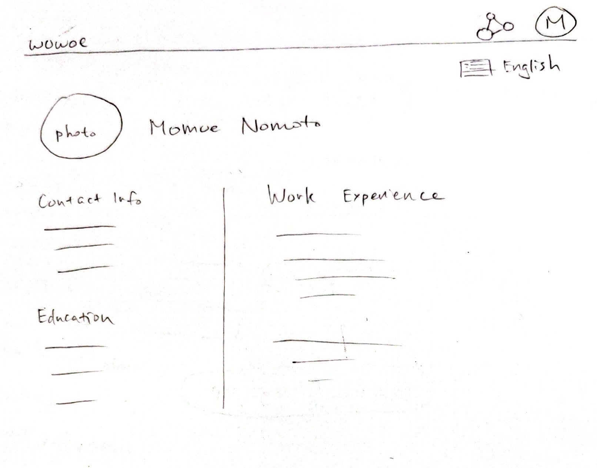
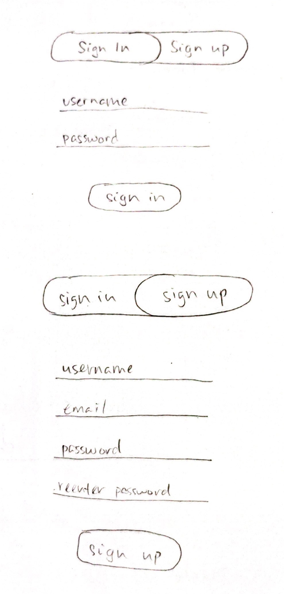
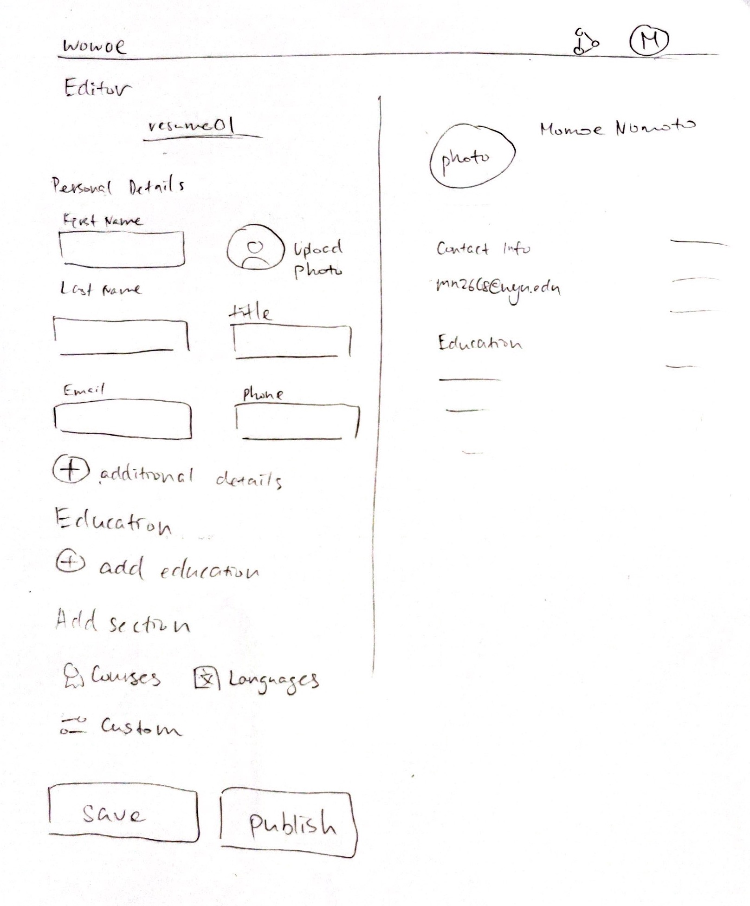
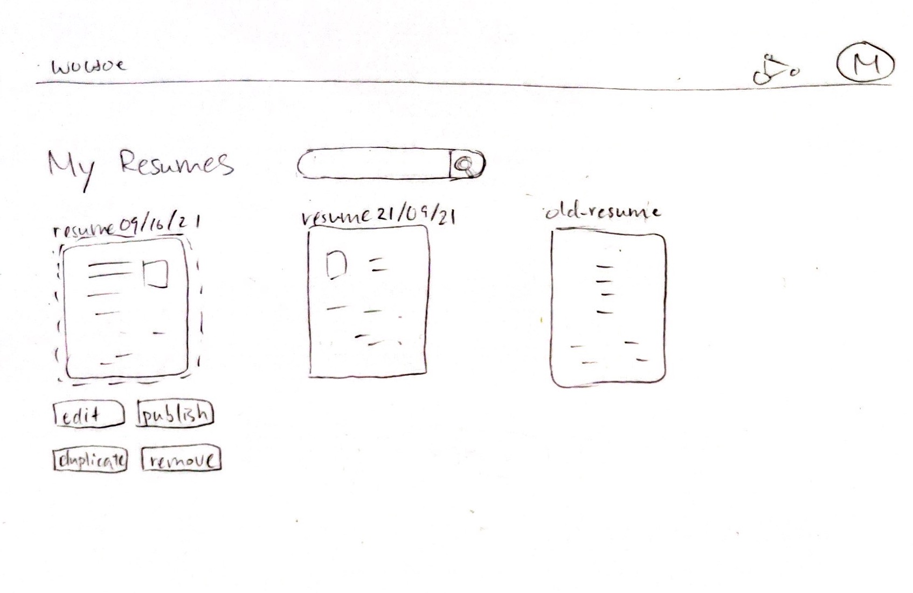
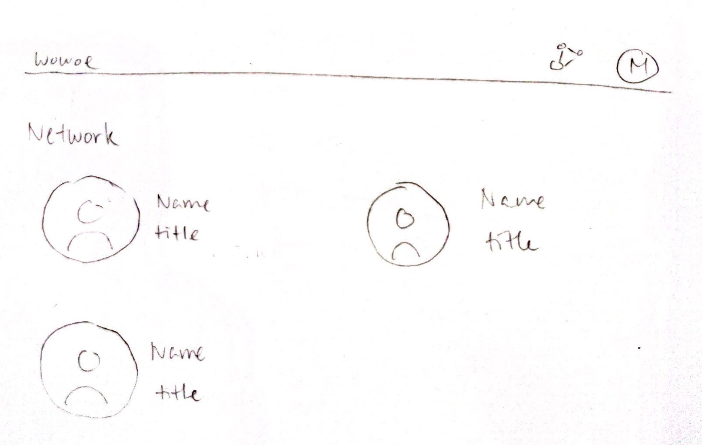
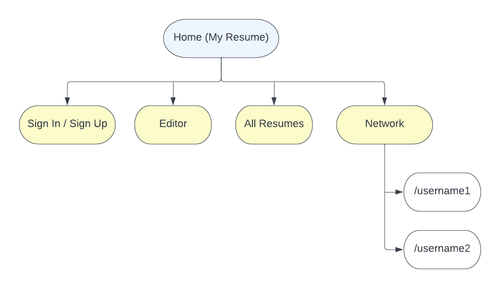

<!-- The content below is an example project proposal / requirements document. Replace the text below the lines marked "__TODO__" with details specific to your project. Remove the "TODO" lines.

(__TODO__: your project name)-->

# Wowoe

## Overview

<!--(__TODO__: a brief one or two paragraph, high-level description of your project)

Remembering what to buy at the grocery store is waaaaay too difficult. Also, shopping for groceries when you're hungry leads to regrettable purchases. Sooo... that's where Shoppy Shoperson comes in!

Shoppy Shoperson is a web app that will allow users to keep track of multiple grocery lists. Users can register and login. Once they're logged in, they can create or view their grocery list. For every list that they have, they can add items to the list or cross off items.

What better way to kill time than word games? Getting tired of Wordle? Try Wowoe! 
Wowoe is a simple web-based word game that refreshes every hour with a new word or you can practice by choosing your own word. The aim of the game is to get the highest score by finding words that are most related to the word of the hour or your own chosen word. You have 5 chances to get the highest score as possible. Once you sign in, you can keep track of your hourly score trend and look at your highest record. You can also compare your record to the highest record of other players.-->

Wowoe is a web app to show off your work experience, skills, and accomplishments. Users can register and login and once they're logged in, they can create their own customized interactive resume page. They can add a photo, contact information, and sections to their resumes. Each section of the resume can be a list, a collection of tags, a meter, or a timeline. The resume can also be translated into various languages. Past resumes can be saved and viewed as well. 

## Data Model

<!--(__TODO__: a description of your application's data and their relationships to each other) 

The application will store Users, Lists and Items

* users can have multiple lists (via references)
* each list can have multiple items (by embedding)

(__TODO__: sample documents)

An Example User:

```javascript
{
  username: "shannonshopper",
  hash: // a password hash,
  lists: // an array of references to List documents
}
```

An Example List with Embedded Items:

```javascript
{
  user: // a reference to a User object
  name: "Breakfast foods",
  items: [
    { name: "pancakes", quantity: "9876", checked: false},
    { name: "ramen", quantity: "2", checked: true},
  ],
  createdAt: // timestamp
}
```

The application will store Users, Stats, and CurrentGame.

* each user will have their own game stats 
* the game stats will include the status of the current game (via embedding)

An Example User:

```javascript
{
  username: "momoe",
  hash: // a password hash,
  stats: // an object with attributes for highest score, past scores (list), current game document
}
```

An Example CurrentGame Document:

```javascript
{
  user: // a reference to a User object
  id: // game id,
  keyword: "yellow", // keyword of the game
  guesses: [
    { word: "banana", score: "78", rank: 2}, // cumulative scores determines your final score
    { word: "color", score: "95", rank: 1}, // rank determines how closely related the word is compared to other words
    {...},
    {...},
    {...} // 5 entries for 5 guesses
  ],
  createdAt: // timestamp so game will expire before the next hour or in an hour or when user starts new game
}
```
-->

The application will store Users, Resumes, and Sections.

* each user will have their own resume page (via a reference)
* a resume page can have multiple sections (via references)
* each section will have a different type and data associated with it

An Example User:

```javascript
{
  username: "momoe",
  hash: // a password hash
  email: // email during creation
  lastVisited: // date of last visit 
  published: // id of currently published resume
  resumes:[] // an array of resume IDs
}
```

An Example Resume:
```javascript
{
  id: // id of resume
  photo: // link to photo
  personalInfo: {first: 'Momoe', last: 'Nomoto', title: 'Software Engineer', email:'mn2668@nyu.edu', phone:'9178160261'} // embedded contact info
  lastEdited: // date of last edit
  sections: [] // an Array of references to different sections
}
```

An Example Section:
```javascript
{
  id: // id of section
  name: // name of section
  type: // type of section: list, timeline, tags, meter, etc
  data: [] // Array of strings
}
```

## [Link to Commented First Draft Schema](db.mjs) 

<!--(__TODO__: create a first draft of your Schemas in db.mjs and link to it)-->

## Wireframes
<!--
(__TODO__: wireframes for all of the pages on your site; they can be as simple as photos of drawings or you can use a tool like Balsamiq, Omnigraffle, etc.)

/list/create - page for creating a new shopping list


/list - page for showing all shopping lists


/list/slug - page for showing specific shopping list


-->

/resume - page for showing my current published resume

Not logged in yet view:


Logged in view:


/resume/auth - page for signing in or signing up



/resume/resume-id/edit - page for editing my resume



/resume/all - page for showing all of my resumes



/resume/network - page for showing everyone else' published resumes



/resume/username - page for showing someone else' published resume, looks the same as homepage


## Site map
<!--
(__TODO__: draw out a site map that shows how pages are related to each other)

Here's a [complex example from wikipedia](https://upload.wikimedia.org/wikipedia/commons/2/20/Sitemap_google.jpg), but you can create one without the screenshots, drop shadows, etc. ... just names of pages and where they flow to.-->



## User Stories or Use Cases

<!--
(__TODO__: write out how your application will be used through [user stories](http://en.wikipedia.org/wiki/User_story#Format) and / or [use cases](https://en.wikipedia.org/wiki/Use_case))

1. as non-registered user, I can register a new account with the site
2. as a user, I can log in to the site
3. as a user, I can create a new grocery list
4. as a user, I can view all of the grocery lists I've created in a single list
5. as a user, I can add items to an existing grocery list
6. as a user, I can cross off items in an existing grocery list


1. as a non-registered user, I can register a new account with the site
2. as a non-registered user, I can view the leaderboard containing top 5 players and their scores
3. as a user, I can log in to the site
4. as a user, I can play the game of the hour
5. as a user, I can specify my own keyword and start the game at any moment
6. as a user, I can view my guesses
7. as a user, I can view my past scores
8. as a user, I can view my highest record
9. as a user, I can view the scoreboard and where I am placed
-->
1. as a non-registered user, I can register a new account with the site
2. as a non-registered user, I can view someone else's resume with their link.
3. as a user, I can log in to the site
4. as a user, I can start my own resume
5. as a user, I can add sections to my resume
6. as a user, I can add data to my sections
7. as a user, I can choose the type of my section
8. as a user, I can also view other resumes
9. as a user, I can translate my resume into another language

## Research Topics

<!--(__TODO__: the research topics that you're planning on working on along with their point values... and the total points of research topics listed)

* (5 points) Integrate user authentication
    * I'm going to be using passport for user authentication
    * And account has been made for testing; I'll email you the password
    * see <code>cs.nyu.edu/~jversoza/ait-final/register</code> for register page
    * see <code>cs.nyu.edu/~jversoza/ait-final/login</code> for login page
* (4 points) Perform client side form validation using a JavaScript library
    * see <code>cs.nyu.edu/~jversoza/ait-final/my-form</code>
    * if you put in a number that's greater than 5, an error message will appear in the dom
* (5 points) vue.js
    * used vue.js as the frontend framework; it's a challenging library to learn, so I've assigned it 5 points

10 points total out of 8 required points (___TODO__: addtional points will __not__ count for extra credit)
-->
* (1 points) Use external API
  * One to translate all text to another language
* (2 points) Use a CSS framework such as Bootstrap
  * To make the user interface nice
* (6 points) Front-end framework
  * To allow front-end resume editing experience smooth

9 points total out of 8 required points

## [Link to Initial Main Project File](app.mjs) 

<!--(__TODO__: create a skeleton Express application with a package.json, app.mjs, views folder, etc. ... and link to your initial app.mjs)-->

## Annotations / References Used

(__TODO__: list any tutorials/references/etc. that you've based your code off of)

<!--
1. [passport.js authentication docs](http://passportjs.org/docs) - (add link to source code that was based on this)
2. [tutorial on vue.js](https://vuejs.org/v2/guide/) - (add link to source code that was based on this)
-->
